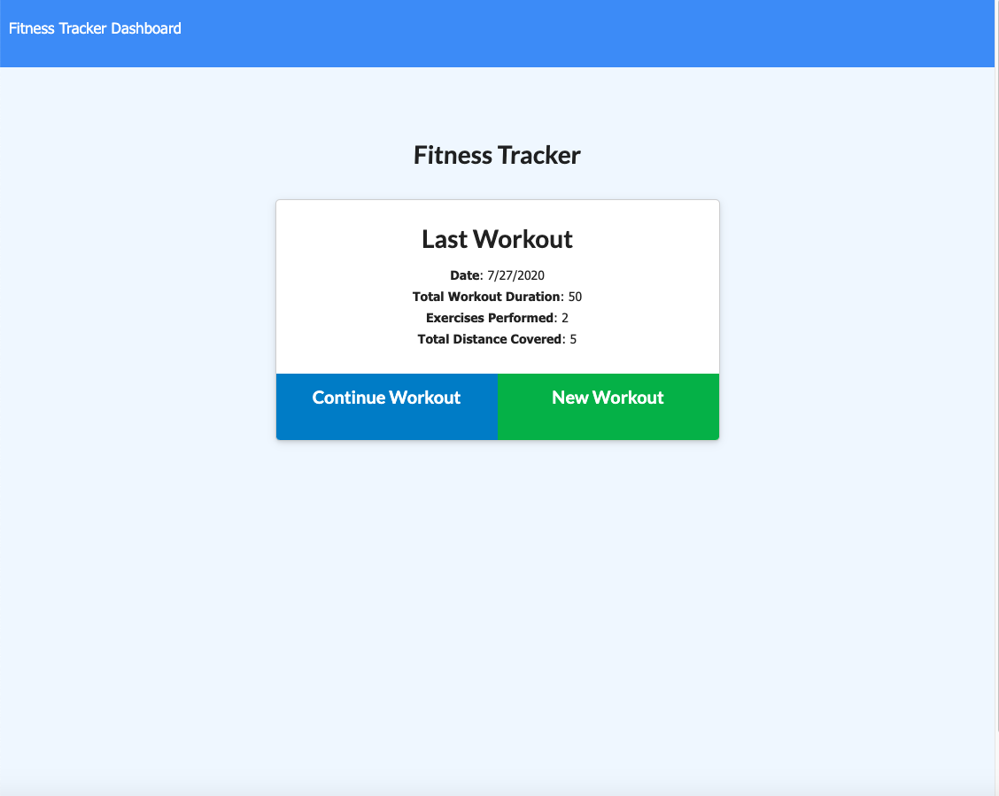
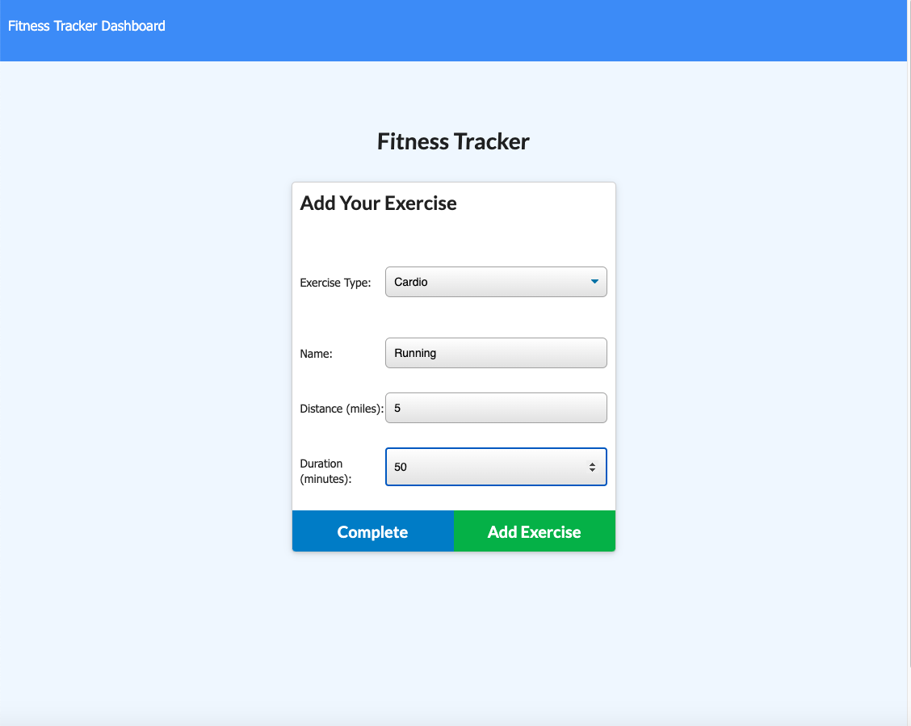
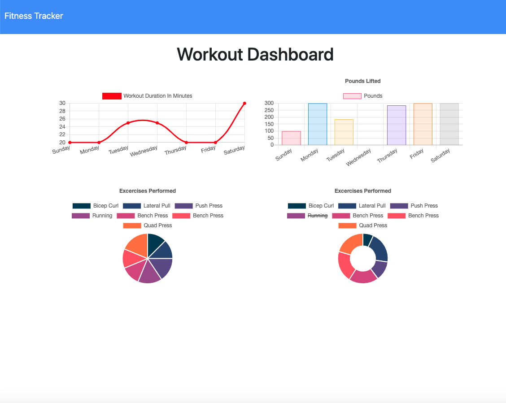

# gt-hw-no-sql-workout

## Description 

This is a homework requirement for GT Full Stack Flex Program. We are using 

## Table of Contents

* [Installation](#installation)
* [Usage](#usage)
* [Credits](#credits)
* [MIT License](#mit_license)
* [Badges](#badges)
* [Contributing](#contributing)
* [Tests](#tests)

## Installation

* Open up Heroku Webpage and View App

* Copy github repo and clone to local computer

[Link to Github Repo](https://crystalwatkins.github.io/gt-hw-no-sql-workout/.)
 
[Link to Heroku Website](https://sheltered-tor-04819.herokuapp.com/).

## Usage 

This is a no SQL database using mongoose db. We are creating a fitness app that allows you to add a workout based on cardio or resistance. You then input the fields required for your fitness workout and it will log the workout that you did on the home page. From there, you can click the fitness dashboard and you will see the last 7 days of your workout recorded as stats. 

[Link to Github Repo](https://crystalwatkins.github.io/gt-hw-no-sql-workout/.).
 
[Link to Heroku Website](https://sheltered-tor-04819.herokuapp.com/).

## Credits

This was a no SQL app created for the Georgia Tech, FullStack Flex Program.

## MIT_License

Copyright (c) [2020] [Crystal Watkins]

Permission is hereby granted, free of charge, to any person obtaining a copy
of this software and associated documentation files (the "Software"), to deal
in the Software without restriction, including without limitation the rights
to use, copy, modify, merge, publish, distribute, sublicense, and/or sell
copies of the Software, and to permit persons to whom the Software is
furnished to do so, subject to the following conditions:

The above copyright notice and this permission notice shall be included in all
copies or substantial portions of the Software.

THE SOFTWARE IS PROVIDED "AS IS", WITHOUT WARRANTY OF ANY KIND, EXPRESS OR
IMPLIED, INCLUDING BUT NOT LIMITED TO THE WARRANTIES OF MERCHANTABILITY,
FITNESS FOR A PARTICULAR PURPOSE AND NONINFRINGEMENT. IN NO EVENT SHALL THE
AUTHORS OR COPYRIGHT HOLDERS BE LIABLE FOR ANY CLAIM, DAMAGES OR OTHER
LIABILITY, WHETHER IN AN ACTION OF CONTRACT, TORT OR OTHERWISE, ARISING FROM,
OUT OF OR IN CONNECTION WITH THE SOFTWARE OR THE USE OR OTHER DEALINGS IN THE
SOFTWARE.

## Badges

## Contributing

Not currently taking any additional contributions at this time.

## Tests

There are no tests for this code.